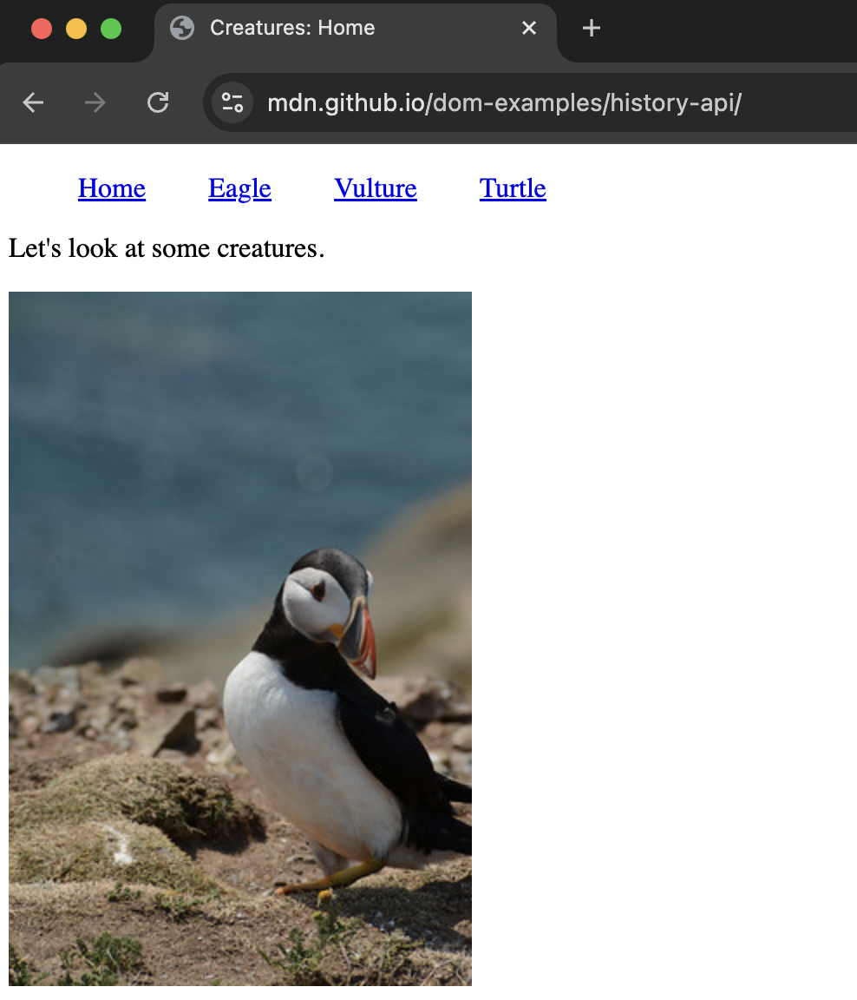
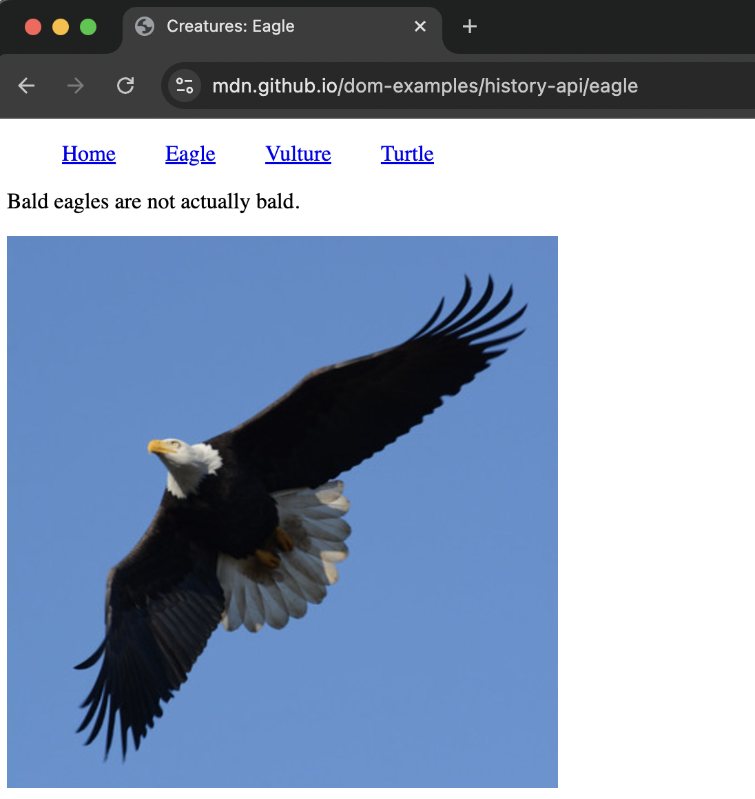
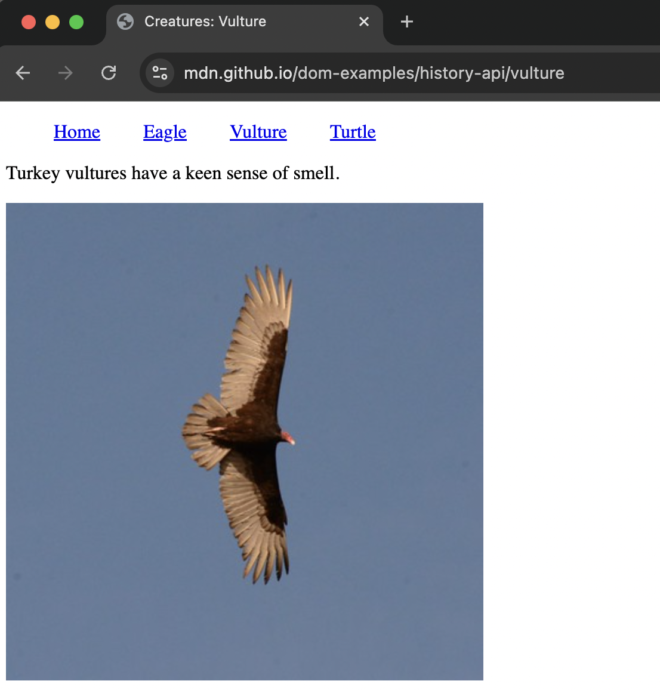
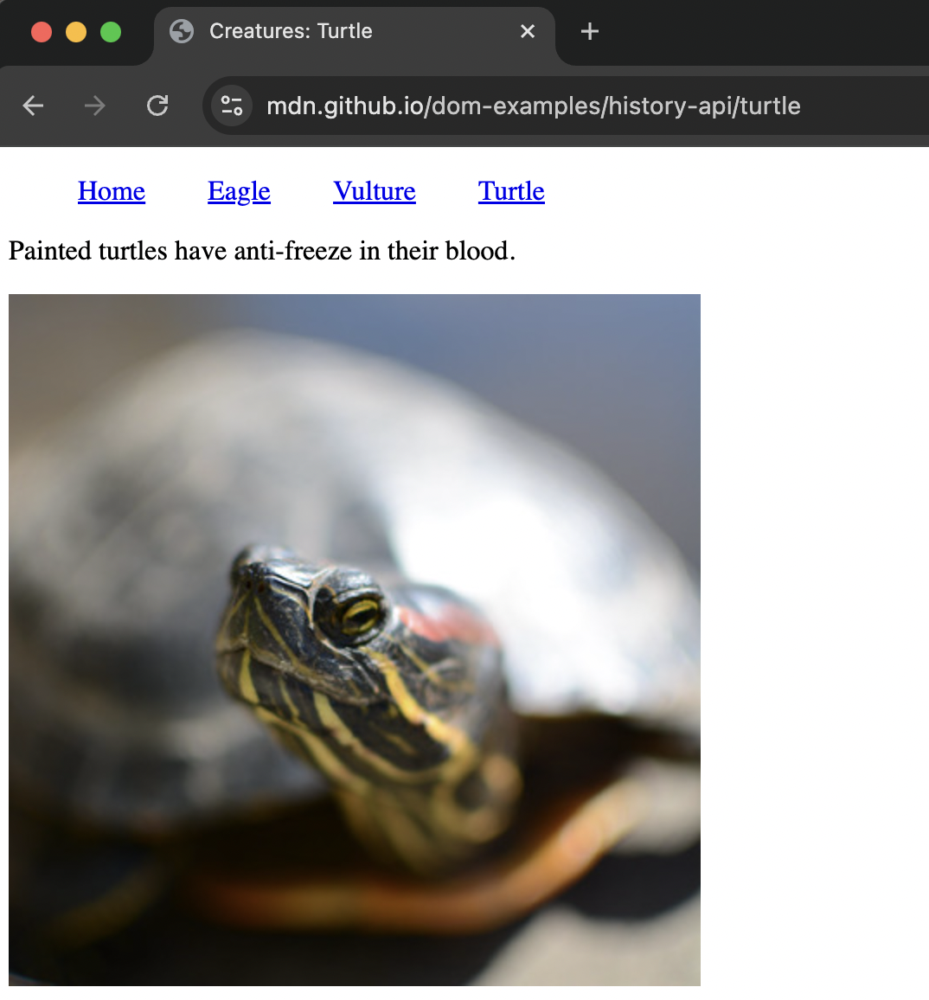

전통적인 웹 페이지는 콘텐츠를 변경할 때마다 전체 페이지를 새로 로드해야 했습니다. 하지만 웹 애플리케이션이 점점 복잡해지면서 새로고침 없이 콘텐츠를 동적으로 업데이트하는 Single Page Application(SPA)의 필요성이 커졌고, 이를 지원하기 위해 **History API**의 `pushState`와 `replaceState` 메서드가 등장했습니다. 이 메서드들을 통해 SPA에서도 마치 여러 페이지를 이동하는 것처럼 브라우저 네비게이션을 구현할 수 있습니다.

이번 글에서는 이 두 메서드가 등장한 배경과 기능, 그리고 이를 활용한 간단한 SPA 예제를 통해 History API의 활용법을 소개합니다.

# History API가 등장한 배경

과거 웹은 정적 HTML 문서의 링크 연결 구조로 되어 있어, 작은 콘텐츠 변화에도 전체 페이지를 새로 로드해야 했습니다. 점차 웹이 단순 문서 뷰어를 넘어 복잡한 애플리케이션 기능을 갖추게 되면서, 웹의 동적 콘텐츠 업데이트에 대한 필요성이 커졌고 SPA라는 개념이 등장했습니다.

SPA는 하나의 HTML 문서에서 브라우저의 새로 고침 없이 유저의 상호작용에 따라 콘텐츠를 동적으로 업데이트합니다. 하지만 SPA는 단일 페이지로 구성되기 때문에 브라우저의 기본 네비게이션 기능인 뒤로 가기나 앞으로 가기를 사용할 수 없는 한계가 있었습니다. 이 문제를 해결하기 위해 [**History API**](https://developer.mozilla.org/en-US/docs/Web/API/History_API)가 등장하게 되었고, 이 API를 통해 SPA에서도 여러 페이지를 이동하는 것처럼 유저 경험을 제공할 수 있게 되었습니다.

# History API의 `pushState`와 `replaceState` 메서드

### History API란?

**History API**는 browser session history(브라우저 세션에서 기록된 이동 내역)을 관리하고 접근할 수 있는 인터페이스입니다. browser session history에는 사용자가 현재의 윈도우 탭이나 iframe 내에서 방문한 페이지 이력이 기록되며, 이 데이터는 스택(stack) 형태로 관리됩니다. History api를 통해 개발자는 사용자의 세션 히스토리를 조작하고 제어할 수 있습니다.

### history.pushState() 메서드

- `pushState()` 메서드는 히스토리 스택에 새로운 엔트리를 추가할 수 있는 메서드입니다. 이 엔트리는 state object와 URL 정보와 함께 저장될 수 있습니다.
- state object는 JSON으로 직렬화할 수 있는 JavaScript 객체면 모두 가능하며, 엔트리가 저장할 상태 정보를 담고 있습니다.
- URL은 절대 경로와 상대 경로 모두 사용 가능하며, 현재 페이지와 동일한 출처(same-origin)여야 합니다.
- `pushState()`를 사용해 엔트리를 추가하면 브라우저의 주소 표시줄은 변경되지만, 페이지는 새로고침되지 않고 현재 document가 유지됩니다.
- 사용자가 브라우저의 뒤로 가기나 앞으로 가기 버튼을 누르거나 `history.go()`, `history.back()`, `history.forward()` 메서드를 통해 히스토리 스택을 탐색할 때, `pushState()`로 추가된 엔트리로 이동하면 [**popstate**](https://developer.mozilla.org/en-US/docs/Web/API/Window/popstate_event) 이벤트가 발생합니다.
- popstate 이벤트 핸들러는 해당 엔트리의 state object를 참조하여 콘텐츠를 업데이트하거나 필요한 작업을 수행할 수 있습니다. 참고로, state object가 없는 엔트리는 popstate 이벤트가 발생하지 않습니다.

### history.replaceState() 메서드

- `replaceState()` 메서드는 현재 히스토리 엔트리를 새로운 엔트리로 교체합니다.
- `pushState()`와 마찬가지로 state object와 URL 정보를 함께 저장할 수 있습니다.
- 현재 엔트리의 상태나 URL을 업데이트할 때 `replaceState()`를 사용할 수 있습니다.

    > 단순히 pushState()나 replaceState()를 호출해 히스토리를 변경할 경우, popstate 이벤트는 발생하지 않습니다. 이벤트는 히스토리 탐색 중에만 트리거됩니다.
> 
- 사용 예시
    
    ```jsx
    window.addEventListener("popstate", (event) => {
      console.log(
        `location: ${document.location}, state: ${JSON.stringify(event.state)}`,
      );
    });
    history.pushState({ page: 1 }, "title 1", "?page=1");
    history.pushState({ page: 2 }, "title 2", "?page=2");
    history.replaceState({ page: 3 }, "title 3", "?page=3");
    history.back(); // Logs "location: http://example.com/example.html?page=1, state: {"page":1}"
    history.back(); // Logs "location: http://example.com/example.html, state: null"
    history.go(2); // Logs "location: http://example.com/example.html?page=3, state: {"page":3}"
    ```
    

# 간단한 SPA 예제 만들기

간단한 SPA를 구성하는 소스 코드를 통해 `pushState()`와 `replaceState()`의 활용법을 살펴보겠습니다. 해당 소스 코드는 [MDN에서 제공하는 예제](https://github.com/mdn/dom-examples/tree/main/history-api)를 가져와 구성하였습니다.

### [spa 화면 구성](https://mdn.github.io/dom-examples/history-api/)





### HTML 구조
초기 문서는 다음과 같이 정적인 HTML로 구성되며, 이 HTML 문서를 기반으로 SPA를 구성합니다.

```html
<!DOCTYPE html>
<html lang="en">
  <head>
    <meta charset="utf-8" />
    <title>Creatures: Home</title>
    <script src="script.js" defer></script>
    <style>
      .nav li {
        display: inline-block;
        margin-right: 2rem;
      }
    </style>
  </head>

  <body>
    <ul class="nav">
      <li><a href="/dom-examples/history-api/">Home</a></li>
      <li><a href="eagle" data-creature="eagle">Eagle</a></li>
      <li><a href="vulture" data-creature="vulture">Vulture</a></li>
      <li><a href="turtle" data-creature="turtle">Turtle</a></li>
    </ul>

    <p id="description">Let's look at some creatures.</p>

    
  </body>
</html>
```

### 페이지 이동 함수 및 이벤트 핸들러 추가

각 리스트 항목에 클릭 이벤트 핸들러를 추가하여 특정 콘텐츠를 불러오고, 새로운 URL과 state object와 함께 새로운 엔트리를 히스토리에 추가합니다.

```jsx
// Update the page with the new content
function displayContent(content) {
  document.title = `Creatures: ${content.name}`;

  const description = document.querySelector("#description");
  description.textContent = content.description;

  const photo = document.querySelector("#photo");
  photo.setAttribute("src", content.image.src);
  photo.setAttribute("alt", content.image.alt);
}

// When a link is clicked: update the page for that creature.
// From a user perspective, this will look like the loading of a new page.

document.addEventListener("click", async (event) => {
  const creature = event.target.getAttribute("data-creature");
  if (creature) {
    event.preventDefault();
    try {
      const response = await fetch(`creatures/${creature}.json`);
      const json = await response.json();
      displayContent(json);
      // Add a new entry to the history.
      // This simulates loading a new page.
      history.pushState(json, "", creature);
    } catch (err) {
      console.error(err);
    }
  }
});
```

### popstate 이벤트 리스너

브라우저 뒤로 가기/앞으로 가기 버튼, history.go/back/forward를 통한 히스토리 전환 시, `popstate` 이벤트가 트리거되며, 이벤트 객체에서 state object를 가져와 콘텐츠를 업데이트합니다.

```jsx
// Handle forward/back buttons
window.addEventListener("popstate", (event) => {
  // If a state has been provided, we have a "simulated" page
  // and we update the current page.
  if (event.state) {
    // Simulate the loading of the previous page
    displayContent(event.state);
  }
});
```
### 첫 로드시 엔트리 교체
SPA 초기 로드시 추가되는 엔트리는 저장된 state가 없기 때문에 해당 엔트리로 이동 시 `popstate` 이벤트가 트리거되지 않습니다. 따라서  SPA 초기 로드시, 필요한 콘텐츠의 데이터와 함께 초기 히스토리 엔트리를 변경하여 SPA의 페이지를 구성합니다.
```jsx
// Create state on page load and replace the current history with it
const image = document.querySelector("#photo");
const initialState = {
  description: document.querySelector("#description").textContent,
  image: {
    src: image.getAttribute("src"),
    alt: image.getAttribute("alt"),
  },
  name: "Home",
};
history.replaceState(initialState, "", document.location.href);
```

이번 글에서는 History API의 pushState와 replaceState를 활용해 SPA에서 브라우저 네비게이션을 구현하는 방법을 살펴보았습니다. react-router-dom과 같은 라이브러리나 Next.js와 같은 프레임워크를 사용하고 있다면, 이러한 도구에서 History API가 어떻게 활용되는지 알아보면 실제 애플리케이션에서의 라우팅 과정을 이해하고 적용하는 데 유용할 것입니다.


# 참고 자료

- [https://developer.mozilla.org/en-US/docs/Web/API/History](https://developer.mozilla.org/en-US/docs/Web/API/History)
- [https://developer.mozilla.org/en-US/docs/Web/API/Window/popstate_event](https://developer.mozilla.org/en-US/docs/Web/API/Window/popstate_event)
- [https://developer.mozilla.org/en-US/docs/Web/API/History_API/Working_with_the_History_API](https://developer.mozilla.org/en-US/docs/Web/API/History_API/Working_with_the_History_API)
