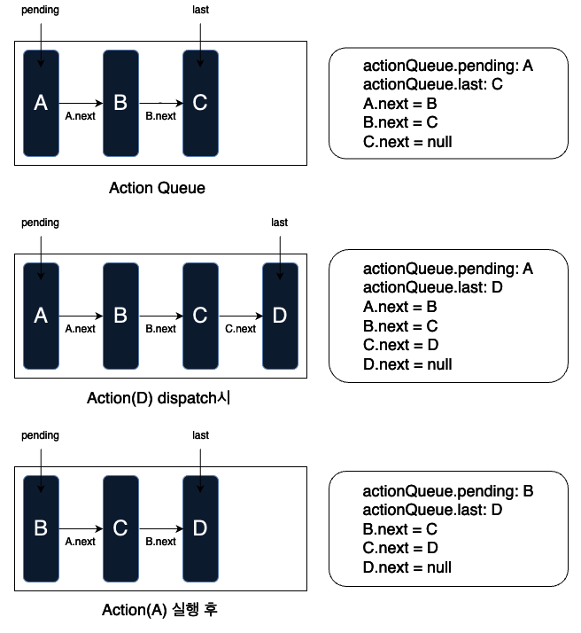

Next 애플리케이션(14 버전)에서 클라이언트 사이드 중복라우팅이 어떻게 처리되는지 살펴보겠습니다.
next 애플리케이션에서 클라이언트 사이드 라우팅은 주로 세 가지 핵심 데이터 `appRouterState`, `actionQueue`, 그리고 `appRouter`에 의해 관리됩니다.

## 1. appRouterState

`appRouterState`는 애플리케이션의 현재 라우터 상태를 유지하는 데이터입니다. 

```tsx

type AppRouterState = {
    buildId: string;
    /**
     * The router state, this is written into the history state in app-router using replaceState/pushState.
     * - Has to be serializable as it is written into the history state.
     * - Holds which segments and parallel routes are shown on the screen.
     */
    tree: FlightRouterState;
    /**
     * The cache holds React nodes for every segment that is shown on screen as well as previously shown segments.
     * It also holds in-progress data requests.
     * Prefetched data is stored separately in `prefetchCache`, that is applied during ACTION_NAVIGATE.
     */
    cache: CacheNode;
    /**
     * Cache that holds prefetched Flight responses keyed by url.
     */
    prefetchCache: Map<string, PrefetchCacheEntry>;
    /**
     * Decides if the update should create a new history entry and if the navigation has to trigger a browser navigation.
     */
    pushRef: PushRef;
    /**
     * Decides if the update should apply scroll and focus management.
     */
    focusAndScrollRef: FocusAndScrollRef;
    /**
     * The canonical url that is pushed/replaced.
     * - This is the url you see in the browser.
     */
    canonicalUrl: string;
    /**
     * The underlying "url" representing the UI state, which is used for intercepting routes.
     */
    nextUrl: string | null;
};
```

`Promise<AppRouterState> | AppRouterState` 타입의 React context로 관리되며, context는 React의 `useState`로 정의된 상태를 가지고 있습니다. 이 상태는 애플리케이션의 [history](https://developer.mozilla.org/en-US/docs/Web/API/History_API)와 동기화됩니다.`appRouterState`가 변경되면 이를 구독하는 effect가 실행되어 history가 업데이트되며, history의 변경은 [popstate](https://developer.mozilla.org/ko/docs/Web/API/Window/popstate_event) 이벤트 핸들러를 통해 `appRouterState`를 업데이트합니다.

```tsx
// AppRouterStateContext.Provider보다 상위 레벨에서 렌더링
function HistoryUpdater({
    appRouterState,
}: {
    // use(appRouterStateContext)로 전달됨
    appRouterState;
}) {
    useInsertionEffect(() => {
        // histoy update...
    }, [appRouterState]);
    return null;
}
```

## 2. actionQueue

`actionQueue`는 라우팅 액션의 실행을 관리하는 데이터로, context로 관리됩니다.

```tsx
type AppRouterActionQueue = {
    state: AppRouterState | null;
    devToolsInstance?: ReduxDevToolsInstance;
    dispatch: (payload: ReducerActions, setState: DispatchStatePromise) => void;
    action: (state: AppRouterState, action: ReducerActions) => ReducerState;
    pending: ActionQueueNode | null;
    needsRefresh?: boolean;
    last: ActionQueueNode | null;
};
```

`actionQueue`의 주요 프로퍼티는 다음과 같습니다:

- `actionQueue.pending`: 현재 처리 중인 action node를 담고 있으며, `actionQueue.pending.next`를 통해 다음 대기 중인 action node를 참조할 수 있습니다.
    
   ```tsx
   type ActionQueueNode = {
    payload: ReducerActions;
    next: ActionQueueNode | null;
    resolve: (value: ReducerState) => void;
    reject: (err: Error) => void;
    discarded?: boolean;
   };
   ```
    
- `actionQueue.last`: queue의 마지막 노드를 나타냅니다.
- `actionQueue.state`: 라우트 변경 전의 `appRouterState`를 가지고 있으며, 라우팅 처리 후 `newAppRouterState`로 업데이트하기 직전에 할당됩니다.
- `actionQueue.dispatch`는 두 가지 주요 작업을 수행합니다:
    1. 새로운 promise를 생성하고, `appRouterStateContext`를 해당 promise로 업데이트하여 현재 라우팅 중임을 알립니다.
    2. 들어온 라우팅 액션을 처리하거나 대기시킵니다.
- **`actionQueue.action`**: 핵심 라우팅 과정을 수행하는 함수로, 라우트 데이터 프리패칭, 트리 구성 등의 작업을 처리합니다. `actionQueue.action`의 실행이 완료된 후, 반환값에 기반하여 `appRouterState`가 업데이트됩니다.

## 3. appRouter

클라이언트 라우팅 함수들을 포함하고 있으며, context로 관리됩니다.    
```tsx
/**
   * The app router that is exposed through `useRouter`. It's only concerned with dispatching actions to the reducer, does not hold state.
   */
const appRouter = {
    back: () => window.history.back(),
    forward: () => window.history.forward(),
    prefetch: (href, options) => {
        const action = {
            type: ACTION_PREFETCH,
            url,
        };
        const url = new URL(addBasePath(href), window.location.href);
        actionQueue.dispatch(action, setAppRouterStateContext);
    },
    replace: (href, options = {}) => {
        const action = {
            type: ACTION_NAVIGATE,
            url,
            navigateType: 'replace',
        };
        actionQueue.dispatch(action, setAppRouterStateContext);
    },
    push: (href, options = {}) => {
        const action = {
            type: ACTION_NAVIGATE,
            url,
            navigateType: 'push',
        };
        actionQueue.dispatch(action, setAppRouterStateContext);
    },
    refresh: () => {
        const action = {
            type: ACTION_REFRESH,
            origin: window.location.origin,
        };
        actionQueue.dispatch(action, setAppRouterStateContext);
    },
    fastRefresh: () => {
        const action = {
            type: ACTION_FAST_REFRESH,
            origin: window.location.origin,
        };
        actionQueue.dispatch(action, setAppRouterStateContext);
    },
};
```
`appRouter` context는 `useRouterHook`을 통해 노출되며, 이 인터페이스를 통해 실제 클라이언트 라우팅 요청을 수행할 수 있습니다. 
    

다음으로, `actionQueue.dispatch`에서 수행되는 두 번째 작업을 좀 더 살펴보겠습니다.
## actionQueue.dispatch
**queue가 비어있는 경우,** 새로운 action node를 추가한 즉시 라우팅을 수행합니다.


**queue가 비어있지 않은 경우**, action type에 따라 처리 방식이 달라집니다.

```tsx
type ReducerActions = Readonly<
    | RefreshAction
    | NavigateAction
    | RestoreAction
    | ServerPatchAction
    | PrefetchAction
    | FastRefreshAction
    | ServerActionAction
>;
```

라우팅 액션은 총 여섯 가지 타입으로 나뉘며, `router.back()` 및 `router.forward()`를 통해 dispatch되는 `RestoreAction`과 `router.push()` 및 `router.replace()`를 통해 dispatch되는 `NavigateAction` 타입은 합쳐서 `Navigation` 타입으로 불립니다.

**Navigation Action이 아닌 경우:** action node를 queue에 추가하여 대기시킵니다.



**Navigation Action인 경우:** dispatch된 action type이 `Navigation`인 경우, 대기열에 있는 모든 action(실행중인 action 포함)을 취소하고, dispatch된 액션을 queue에 추가한 즉시 실행합니다.


`actionQqueue.dispatch` 일부 구현 코드는 다음과 같습니다.

```tsx
const actionQueue: AppRouterActionQueue = {
    //  ...
    dispatch: (
        payload: ReducerActions,
        setState: DispatchAppRouterStatePromise
    ) => {
        // step 1
        let resolvers: {
            resolve: (value: ReducerState) => void;
            reject: (reason: any) => void;
        } = { resolve: setState, reject: () => {} };

        const deferredPromise = new Promise<AppRouterState>(
            (resolve, reject) => {
                resolvers = { resolve, reject };
            }
        );

        startTransition(() => {
            // we immediately notify React of the pending promise -- the resolver is attached to the action node
            // and will be called when the associated action promise resolves
            setAppRouterStateContext(deferredPromise);
        });

        // step 2
        const newAction: ActionQueueNode = {
            payload,
            next: null,
            resolve: resolvers.resolve,
            reject: resolvers.reject,
        };

        if (actionQueue.pending === null) {
            // The queue is empty, so add the action and start it immediately
            // Mark this action as the last in the queue
            actionQueue.last = newAction;
            actionQueue.pending = newAction;
            actionQueue.action(actionQueue.state, action.payload);
        } else if (
            payload.type === ACTION_NAVIGATE ||
            payload.type === ACTION_RESTORE
        ) {
            // Navigations (including back/forward) take priority over any pending actions.
            // Mark the pending action as discarded (so the state is never applied) and start the navigation action immediately.
            actionQueue.pending.discarded = true;

            // Mark this action as the last in the queue
            actionQueue.last = action;

            actionQueue.pending = action;
            actionQueue.action(action);
        } else {
            actionQueue.last.next = newAction;
            actionQueue.last = newAction;
        }
    },
};
```

정리하면, 라우팅 작업들은 일반적으로 순서대로, 즉 serial하게 실행되지만, Navigation 작업은 최우선으로 실행됩니다. 따라서 실행 중이거나 대기 중인 작업들은 모두 취소되며, 새로운 Navigation 작업이 즉시 수행됩니다. 이를 통해 사용자는 더욱 매끄럽고 빠른 라우팅 경험을 누릴 수 있게됩니다.