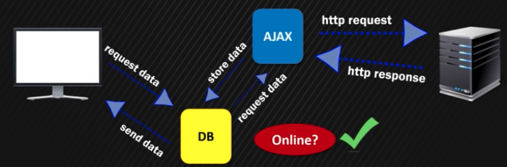

# 섹션 1: Introduction

## AJAX

- 브라우저의 data request 기존 방식은
    - 동기적
        
        send http request → wait → receive response
        
    - 여러 단점 존재
        - page reload 발생
            
            웹사이트의 일부분을 업데이트 할 경우에도(ex. 상품 리스트 나열, 유저 프로필 업데이트 등…) 리로드 발생
            
            웹 사이트 규모가 더 커질 수록 안 좋은 유저 경험을 제공하게 됨
            
- 새로운 방식 등장, ajax, 웹 기술
    1. ‘smaller chunk of data’를 요청, html, xml, json, plain text 등
    2. 필요 시 브라우저가 응답 데이터를 화면에 표시하도록
    3. 페이지 reload를 기다리지 않고 background에서 비동기적으로 수행
    4. 브라우저에서 제공하는 웹 api(XMLHttpRequest, Fetch)로 수행
    
    ajax, asynchronous javascript and xml, 등장 시기에는 xml 기반, 현재는 거의 json으로
    


왜 ajax 개념을 설명하는지?

- CRP 개념을 더 잘 이해하기 위해
    - CRP는 브라우저가 웹페이지를 렌더링하는 과정, 렌더링 하기 전에 웹페이지 리소스를 페치해야 하며 페치에는 ajax 기술이 사용됨
- (CRP 최적화 과정과 별도로) ajax를 통해서도 웹페이지 로딩 최적화, ux 향상 가능!
- spa 개발 with fe web framework(react, vue, …) 에서 사용됨
    
    
    

## XMLHttpRequest

1. set up request
    
    ```jsx
    const xhr = new XMLHttpRequest();
    ```
    
2. create a function to run when the request is done
    
    ```jsx
    xhr.onreadystatechange = function() {
    	if (xhr.readyState == 4 && xhr.status == 200){
    		// handle data
    	}
    }
    ```
    
3. open and send request
    
    ```jsx
    xhr.open('GET', 'https://...'); // HTTP method, server url
    xhr.send();
    ```
    
- browser cache 는 memory에? harddisk에?
    
    “stores page assets on your computer's **hard drive**”
    
    LS, indexedDB도 마찬가지
    
    ajax request 관련 데이터는 memory에 저장됨
    

## Fetch

xmlhttprequest와 다르게 Promise를 return!

```jsx
fetch('https://...') // server url
	.then(data1 => data.json())
	.then(data2 => {
			// handle data
		})
```

- 첫 번째 `.then` method를 통해 받아온 데이터(data1)는 response object
    
    server data(response body 데이터) + extra metadata(date, time. url, …)
    
- json( ) 메서드는 response body 데이터를 가져오기 위한 promise를 return
    
    data2는 json parsed javascript object!
    
    다른 메서드들도 존재. text( ) - return body as text string, blob( ) - return body as blob object, …