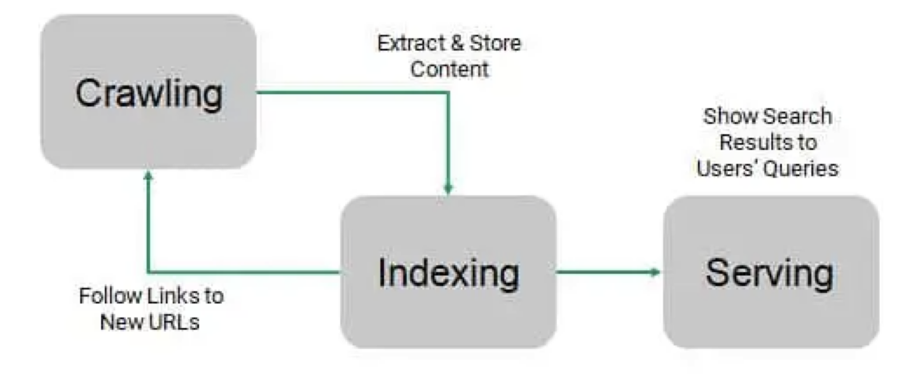
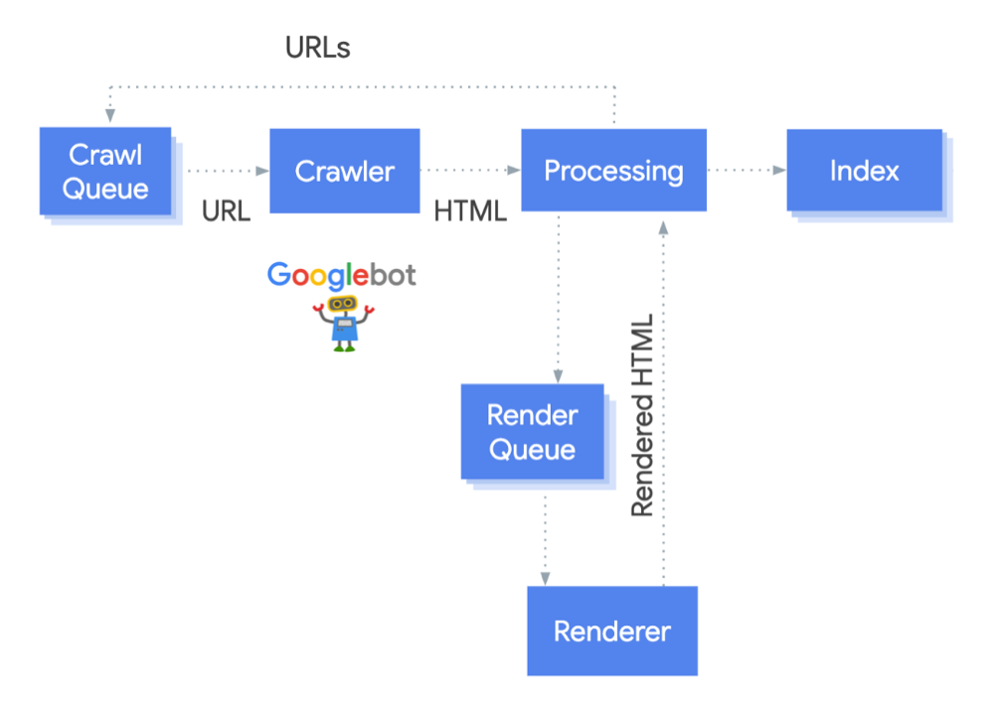

# 0. 서론

최근 웹 애플리케이션에서는 SPA(Single Page Application)가 많이 사용되고 있습니다. SPA는 페이지 이동 없이 필요한 부분만 동적으로 로드하는 방식으로 작동하며, 사용자 경험을 향상시키는 데 큰 역할을 합니다. 그러나 SPA는 검색 엔진 최적화(SEO)에 어려움을 겪습니다. 이번 글에서는 구글 검색 엔진의 작동 방식과 함께 SPA가 SEO에 어려움을 겪는 이유를 알아보고, SEO 방법을 알아보겠습니다.

# 1. Google 검색 엔진 작동 방식

구글 검색은 크게 ‘Crawling’, ‘Indexing’, ‘Serving’ 세 단계로 작동합니다.

> **Crawling**
> 크롤러라는 자동화된 프로그램을 사용하여 인터넷에서 찾은 페이지로부터 텍스트, 이미지, 동영상을 다운로드
> **Indexing**
> 페이지의 텍스트, 이미지, 동영상 파일을 분석하고 대규모 데이터베이스인 Google 색인에 이 정보를 저장
> **Serving**
> 사용자가 구글에서 검색을 하면 구글은 사용자의 검색어와 관련된 정보를 반환

각 단계에 대해 자세히 살펴보겠습니다.

## Crawling

크롤링 단계에서는 **URL Discovery** 와 **Crawl** 과정이 일어납니다. URL Discovery 과정에서는 웹에 어떤 페이지가 존재하는지 파악하게 됩니다. 구글은 계속해서 새 페이지와 업데이트된 페이지를 검색하여 리스트에 추가합니다. 방문한 적이 있는 페이지 이외에도 크롤러가 페이지를 파악하는 과정에서 새 페이지로 연결되는 링크를 따라가면서 혹은 제출된 sitemap(사이트에 있는 페이지, 동영상 및 기타 파일과 그 관계에 관한 정보를 제공하는 파일)을 통해 웹에 존재하는 페이지를 파악합니다. Crawl 과정에서는 발견한 페이지의 내용을 확인하기 위해 페이지 방문하여 한 페이지에서 다른 페이지로 연결되는 링크 따라가며 탐색합니다. Google은 막대한 수의 컴퓨터를 사용하여 웹에 있는 페이지 수십억 개를 크롤링하고, **Googlebot** 크롤러가 이 과정을 수행합니다.

### 크롤링 과정에의 Googlebot의 역할

1. 크롤링 대기열에 있는 페이지 가져오기
   Googlebot은 크롤링 대기열에 있는 페이지를 가져옵니다. 크롤링 대기열은 구글봇이 방문해야 할 URL 목록을 저장하는 큐입니다.

2. HTTP 요청
   크롤링 대기열에서 가져온 페이지의 URL에 HTTP 요청을 보냅니다. Googlebot이 해당 페이지의 robots.txt 파일을 읽고 크롤링 차단 상태 여부를 확인하는데 차단 상태일 경우에는 이 URL에 관한 HTTP 요청을 건너 뛰고 1단계로 돌아갑니다.

3. HTML 분석
   요청에 대한 응답 HTML을 분석합니다.

4. 크롤링 대기열에 새 링크를 추가
   HTML 분석 과정에서 새 링크를 발견하면 크롤링 대기열에 해당 URL을 추가합니다.

사이트가 검색 엔진 로봇에 열려 있으면 웹 사이트가 주기적으로 크롤링됩니다. 구글봇은 링크의 변경 사항이나 끊어진 링크를 발견하면 이를 기록하여 색인을 업데이트할 수 있도록 합니다. 따라서 항상 웹 페이지가 크롤링 가능한 상태인지 확인하여 Google봇에 의해 올바르게 색인화될 수 있도록 해야 합니다.

## Indexing

크롤링된 페이지의 내용을 파악하는 단계입니다. 텍스트 핵심 콘텐츠 및 &lt;title>, &lt;image>, &lt;video> 등 콘텐츠 태그와 alt 등의 속성을 처리하고 분석하는 작업을 수행합니다. 페이지가 인터넷의 다른 페이지와 중복되는지 또는 정식 페이지(canonical page)인지 여부를 결정합니다.

canonical page는 검색 결과에 표시될 수 있는 페이지입니다. 하나의 페이지를 여러 URL로 액세스할 수 있거나 여러 기기 유형을 지원, 서로 다른 페이지에 유사한 콘텐츠가 있는 경우 Google은 이러한 페이지를 같은 페이지의 중복 버전으로 간주하고, URL 중 하나를 표준 버전으로 선택하여 크롤링합니다.

하나의 페이지를 path와 query string 모두 사용해서 접근이 가능하거나(예시1) 모바일, 데스크탑 등의 여러 기기 유형을 지원하는 경우(예시2) 중복 페이지가 발생하게 됩니다.
인덱싱 과정에서 Google은 canonical page를 정하기 위해 먼저 인터넷에서 찾은 비슷한 콘텐츠의 페이지를 그룹으로 묶은 다음(클러스터링 작업) 그룹을 가장 잘 대표하는 페이지를 선택합니다. 웹사이트 소유자가 어떤 URL이 표준 버전인지 Google에 분명하게 알리지 않으면 Google이 사용자 대신 표준 버전을 선택하거나 두 페이지의 중요도를 동일하게 취급하기도 합니다. 그로 인해 원하지 않은 url이 검색 결과에 노출되거나, 같은 컨텐츠의 중복 페이지의 크롤링으로 인해 낭비가 발생하므로 canonical page를 직접 설정해주어 Googlebot이 사이트를 최대한 활용하도록 하는게 좋습니다.
또한, 인덱싱 과정에서는 페이지의 언어, 콘텐츠가 속하는 국가, 페이지의 사용성 과 같은 신호를 수집하며, 이는 검색결과에 페이지를 게재하는 다음 단계에서 사용될 수 있습니다.
canonical page와 해당 클러스터에 관해 수집한 정보는 수천 대의 컴퓨터에서 호스팅되는 ‘Google index’ 대규모 데이터베이스에 저장됩니다.

## Serving

사용자가 검색어를 입력하면 Google 컴퓨터는 색인에서 일치하는 페이지를 검색한 다음 품질이 가장 높고 사용자의 검색어와 가장 관련성이 크다고 판단되는 결과를 반환합니다. 관련성은 사용자의 위치와 언어, 기기와 같은 정보를 비롯하여 수많은 요인으로 결정됩니다. 예를 들어 '자전거 수리점'을 검색하면 파리에 있는 사용자와 홍콩에 있는 사용자에게 서로 다른 결과가 표시됩니다.

# 2. Googlebot의 SPA 크롤링

Googlebot은 html 소스코드를 분석하는 과정에서 페이지 렌더링 여부를 결정합니다. 페이지가 동적으로 생성되는지, JavaScript나 Ajax를 사용하는지, 그리고 페이지의 내용이 얼마나 많은지 등이 판단 기준이 됩니다. 렌더링 할 페이지는 렌더 큐에 추가됩니다. spa는 하나의 HTML 페이지 안에서 JavaScript를 이용하여 페이지의 모든 내용을 동적으로 로드하는 어플리케이션이기 때문에, static HTML pages와 다르게 페이지를 렌더링하는 과정이 일어납니다. 구글 엔진에서는 headless 브라우저인 Chromium 사용해서 js를 실행, ajax 호출하는 단계 수행하여 페이지를 렌더링하고, 렌더링 된 HTML을 분석합니다.

# 3. SPA에서 SEO 이슈

Googlebot이 페이지를 제대로 렌더링하지 못해 HTML이 깨지거나 비어있어 불완전한 컨텐츠에 대한 index가 생성됩니다. 페이지 사이즈가 커서 js 로드가 지연된다던지, 혹은 렌더링 시간이 오래 걸려 렌더링 budget 부족하거나 js 코드 실행중에 에러 발생 하는 등의 상황으로 인해 페이지 렌더링 이슈가 발생할 수 있습니다.

검색 엔진은 인덱싱 과정에서 웹사이트 자체가 아닌 개별 페이지를 랭킹하기 때문에 한 페이지에 대한 색인 생성하게 됩니다. spa의경우, 하나의 페이지에 모든 컨텐츠 들어가 있 여러 컨텐츠 간에 페이지별로 구분이 안 되기 때문에 특정 컨텐츠마다 랭킹하기가 어려워 검색에서 높은 순위를 차지하기 어렵습니다.

또한, Googlebot이 생성된 HTML을 분석하고 찾은 URL 다시 크롤링 대기열에 전달하는 과정에서 페이지 제대로 렌더링 하지 못할 경우 일부 internal link를 놓칠 수 있습니다. 이는 페이지의 구조를 파악하고 랭킹을 어렵게 만듭니다.

# 4. SPA의 SEO 방법

## SSR(Server-Side Rendering)

페이지 요청 시 spa 페이지를 서버에서 클라이언트로 보내기 전에 미리 서버에서 렌더링하는 방법입니다. SSR는 해당 페이지의 렌더링 책임을 Googlebot이 아닌 서버에게 넘겨 봇이 htm l페이지를 파싱하고 색인화를 쉽게 가능하게 합니다.

## SSG(Static Site Generation)

페이지 요청 전에 빌드 시점에 서버 측에서 사전에 페이지를 렌더링하고, 결과물을 HTML로 저장해 놓는 방법입니다. 검색 엔진이 URL을 요청하면 서버에서는 미리 렌더링 된 HTML 을 반환하여 SEO 문제 해결할 수 있습니다.

## SEO 친화적인 URL을 사용하기

ID URL을 사용하고, **랭킹을 원하는 keyword로**, **복잡하지 않게**, **최대 길이 넘어가지 않게**하여 Slug URL을 사용하면 SEO에 도움됩니다.

## 중요한 메타 태그를 html 소스코드에 포함시키기

타이틀, desc, canonical tag, hreflang 등 중요한 메타 태그를 html에 포함시키면 SEO에 도움됩니다.

## internal linking

Googlebot이 페이지에서 링크를 찾을 때 &lt;a> 태그의 href 속성에 있는 url만 고려하기 때문에 internal linking 은 &lt;a> 태그로, 탐색을 원하는 페이지는 페이지 최 상단에 위치하는 것이 좋습니다.

# 참고 자료

- [https://developers.google.com/search/docs/fundamentals/how-search-works?hl=ko](https://developers.google.com/search/docs/fundamentals/how-search-works?hl=ko)
- [https://developers.google.com/search/docs/crawling-indexing/javascript/javascript-seo-basics?hl=ko](https://developers.google.com/search/docs/crawling-indexing/javascript/javascript-seo-basics?hl=ko)
- [https://www.cloudways.com/blog/single-page-website-spa-seo/#googlebot](https://www.cloudways.com/blog/single-page-website-spa-seo/#googlebot)
